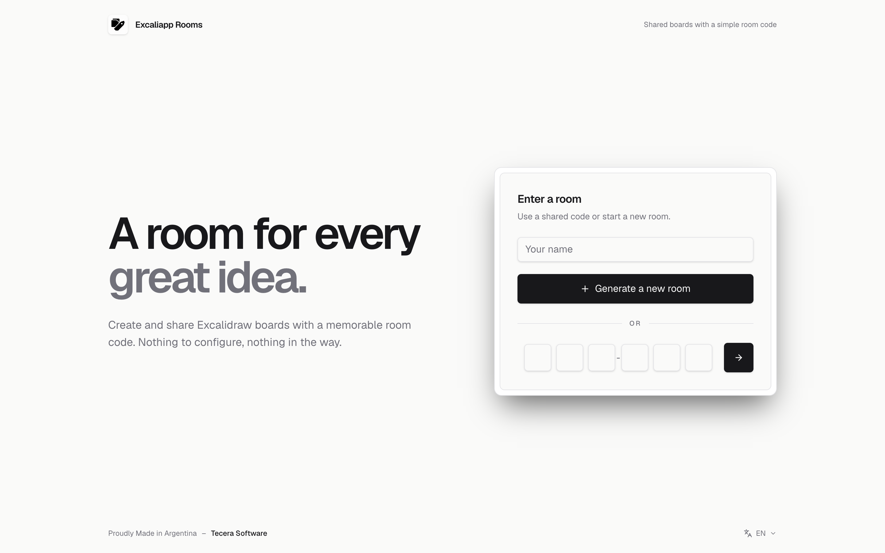

<p align="center">
  
</p>

<h1 align="center">Excaliapp Rooms</h1>

<p align="center">
  Shared rooms for <a href="https://excalidraw.com">Excalidraw</a> boards, with a simple room code.
  <br>
  <a href="https://excali.app"><strong>excali.app</strong></a>
</p>

<p align="center">
  <a href="https://github.com/jmtecera/excaliapp/actions/workflows/check.yml"></a>
  <a href="LICENSE"></a>
  
  
  
</p>

<p align="center">
  <picture>
    <source media="(prefers-color-scheme: dark)" srcset="docs/landing-dark.png">
    
  </picture>
</p>

A room has a short code (`ABC-123`), a shared list of boards, live participant presence, an optional PIN, and a Pomodoro timer that stays in sync for everyone in the room.

## Features

- **Room codes**: start a room in one click and share a memorable `ABC-123` code instead of long links.
- **Shared boards**: keep every Excalidraw board for a project in one list that updates live for everyone.
- **Presence**: see who is in the room right now, with Gravatar avatars.
- **Optional PIN**: lock a room behind a PIN; collaboration links (which carry encryption keys) are only shared after access is granted.
- **Synced Pomodoro**: a focus timer that starts, pauses and resets for the whole room at once.
- **English and Spanish**, with dark, light, and system themes.

## Stack

- [SolidJS](https://www.solidjs.com), TypeScript, Vite, and Tailwind CSS
- Vercel Functions for the HTTP API
- Supabase Postgres functions for room state
- Supabase Realtime for change notifications and presence

## Getting Started

Requirements: Node.js 20.12 or newer, pnpm, and a Supabase project.

```sh
pnpm install
cp .env.example .env    # then fill in your Supabase values
pnpm db:push            # apply database migrations
```

Run the API and the frontend in separate terminals:

```sh
pnpm dev:api
pnpm dev
```

Vite proxies `/api` to the local API on port `8787`.

## Commands

| Command          | Description                              |
| ---------------- | ---------------------------------------- |
| `pnpm dev`       | Start the Vite development server        |
| `pnpm dev:api`   | Start the local API server               |
| `pnpm test`      | Run server tests                         |
| `pnpm typecheck` | Type-check the frontend                  |
| `pnpm build`     | Build the frontend for production        |
| `pnpm check`     | Run tests, type-check, and build         |
| `pnpm db:push`   | Apply pending Supabase migrations        |
| `pnpm preview`   | Preview the production build             |

## Project Layout

```
api/                  Vercel Function entry points
server/handlers.js    Shared HTTP handlers for the API routes
server/supabase.js    Request validation, response filtering, Supabase RPC client
server/sync-server.js Local API server used during development
src/                  SolidJS frontend
supabase/migrations/  Database schema and functions
scripts/              Migration and build helpers
```

## Configuration

Environment variables are read from `.env.local` and `.env`. See [`.env.example`](.env.example) for the full list.

**Server only** — never prefix these with `VITE_`:

| Variable                                 | Description                                                     |
| ---------------------------------------- | --------------------------------------------------------------- |
| `SUPABASE_URL`                           | Supabase project URL                                            |
| `SUPABASE_SECRET_KEY`                    | Server secret key (`SUPABASE_SERVICE_ROLE_KEY` is also accepted) |
| `POSTGRES_URL_NON_POOLING`               | Direct database URL used by `pnpm db:push`                      |
| `ROOM_CREATE_RATE_LIMIT_MAX`             | Room creations allowed per IP per window (default `5`)          |
| `ROOM_CREATE_RATE_LIMIT_WINDOW_SECONDS`  | Rate limit window (default `3600`)                              |
| `TURNSTILE_ENABLED`                      | Require a Cloudflare Turnstile check to create rooms            |
| `TURNSTILE_SECRET`                       | Turnstile secret key                                            |
| `TURNSTILE_HOSTNAMES`                    | Comma-separated hostnames accepted from Turnstile (optional)    |
| `TURNSTILE_TIMEOUT_MS`                   | Turnstile verification timeout (default `5000`)                 |

**Browser:**

| Variable                               | Description                                          |
| -------------------------------------- | ---------------------------------------------------- |
| `VITE_PUBLIC_SUPABASE_URL`             | Supabase project URL, used for Realtime              |
| `VITE_PUBLIC_SUPABASE_PUBLISHABLE_KEY` | Supabase publishable key, used for Realtime          |
| `VITE_API_BASE_URL`                    | API origin; leave empty for same-origin requests     |
| `VITE_TURNSTILE_ENABLED`               | Show the Turnstile check before creating a room      |
| `VITE_TURNSTILE_SITE_KEY`              | Turnstile site key                                   |

Turnstile is optional and can stay disabled during local development. To enable it, create a Managed widget for your hostname and set both `TURNSTILE_ENABLED=true` and `VITE_TURNSTILE_ENABLED=true`.

## Security Model

Room codes work as capability links: anyone with the code can join an unprotected room. When a PIN is set, reading or changing room data requires an access token issued after PIN verification. Tokens expire after 90 days and are stored only as SHA-256 hashes.

The browser never talks to the database directly. API requests are validated in `server/supabase.js` and passed to Postgres functions that are executable only by the service role, which enforce room authorization themselves. Failed PIN attempts are throttled per room and IP address.

Excalidraw collaboration links contain the board's encryption key, so they are only returned to clients with access to the room. Participant email addresses stay in the browser; presence data includes only the MD5 hash Gravatar needs to show an avatar.

## Deployment

The project is configured for Vercel (`vercel.json`). Set the environment variables above in your Vercel project. The `vercel-build` script applies pending migrations when a database URL is available, then builds the frontend.

## License

[MIT](LICENSE)
